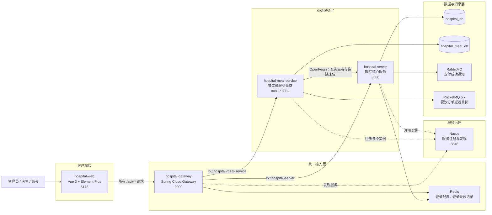
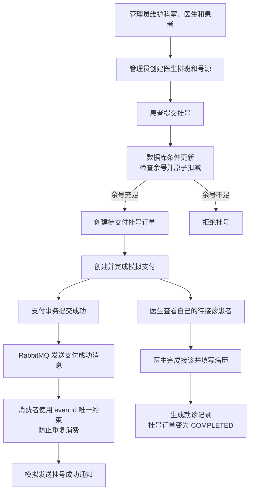
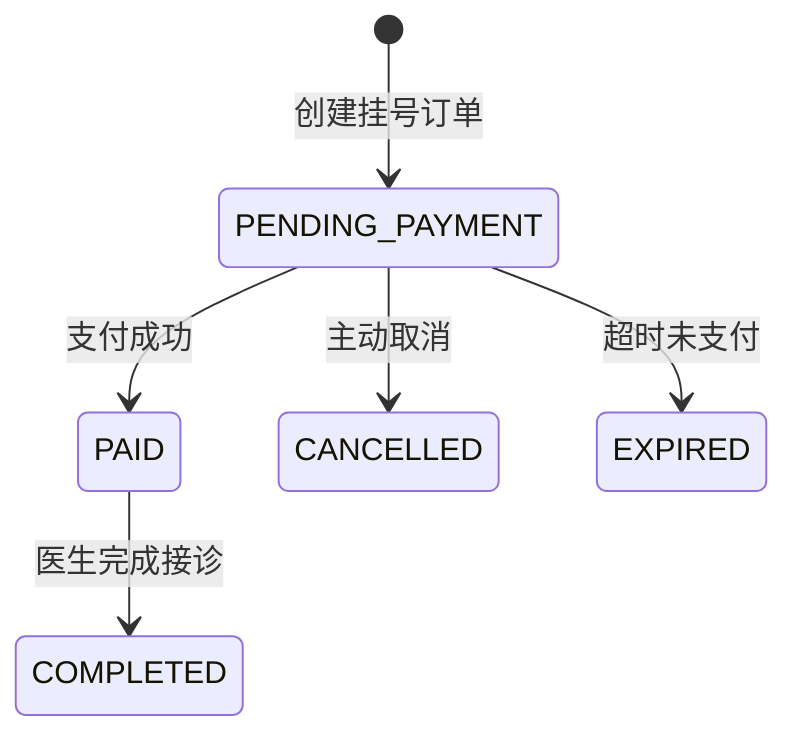
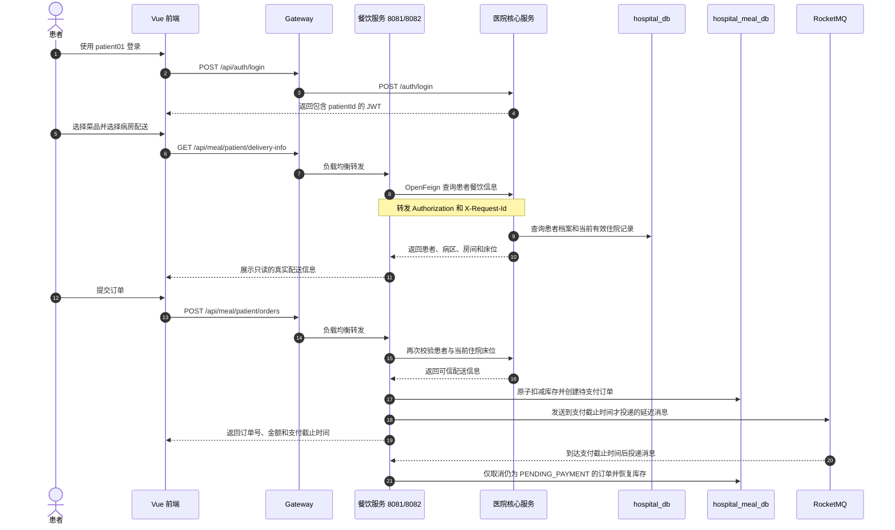
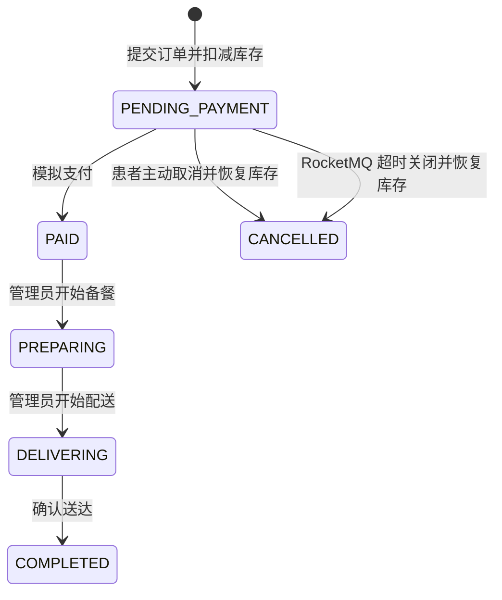

# 医院管理系统 + 医院餐饮微服务

这是一个用于学习 Java 后端、微服务协作和完整业务建模的前后端分离项目。

项目由医院核心服务、医院餐饮微服务、统一网关和 Vue 前端组成，覆盖门诊、住院、餐饮三类业务，并通过 Nacos、OpenFeign、Redis、RabbitMQ 和 RocketMQ 演示服务发现、远程调用、限流、可靠消息与延迟消息。

## 一、系统架构



### 架构要点

- 前端只访问 `hospital-gateway:9000`，不直接区分后端服务。
- Gateway 根据请求路径选择服务，并通过 Nacos 和 Spring Cloud LoadBalancer 转发请求。
- `/api/meal/**` 转发给餐饮服务，`/api/**` 的其他请求转发给医院核心服务。
- 医院核心服务和餐饮微服务使用各自独立的数据库，餐饮服务不能直接查询 `hospital_db`。
- 餐饮服务通过 OpenFeign 调用医院核心服务，获取可信的患者与住院床位信息。
- JWT 由医院核心服务签发，Gateway 原样转发，两个业务服务分别进行认证和权限校验。

## 二、模块职责

| 模块 | 端口 | 主要职责 |
| --- | ---: | --- |
| `hospital-web` | 5173 | 管理员、医生和患者操作页面，所有接口统一访问 Gateway |
| `hospital-gateway` | 9000 | 动态路由、负载均衡、请求 ID、访问日志、Redis 登录限流 |
| `hospital-server` | 8080 | 统一登录、科室医生患者、排班挂号、支付就诊、病区床位和住院管理 |
| `hospital-meal-service` | 8081 / 8082 | 餐厅菜品库存、患者点餐、订单支付、备餐配送、订单超时关闭 |
| Nacos | 8848 | 注册并发现 Gateway、医院核心服务和餐饮服务实例 |
| Redis | 6379 | Gateway 令牌桶限流、医院核心服务登录失败次数记录 |
| RabbitMQ | 5672 / 15672 | 医院核心服务支付成功消息与幂等消费 |
| RocketMQ | 9876 / 18081 | 餐饮订单延迟消息，到期检查未支付订单 |

## 三、角色和功能

### 管理员

- 医院数据概览
- 科室、医生、患者资料管理
- 医生排班和挂号订单管理
- 全院就诊记录查询
- 病区、房间床位和住院记录管理
- 餐厅、菜品分类、菜品和分时库存管理
- 餐饮订单查询及状态流转

### 医生

- 查看个人排班
- 查看属于自己的待接诊患者
- 完成接诊并填写病历
- 查看个人历史就诊记录

### 患者

- 使用医院统一账号登录
- 按日期和早餐、午餐、晚餐查看可售菜单
- 加入点餐单并提交餐饮订单
- 选择病房配送时自动读取真实患者与床位信息
- 查看订单、模拟支付和取消未支付订单

## 四、医院门诊业务流程



### 挂号订单状态



这条流程主要解决：号源不能超卖、支付不能重复处理、医生不能越权接诊其他医生的患者。

## 五、患者病房点餐流程



### 为什么病房地址不能相信前端

前端自动显示患者姓名和床位，是为了减少填写操作；真正的安全保证在后端。

餐饮服务创建病房订单时会重新调用医院核心服务：

1. 从 JWT 获取当前患者 `patientId`，不接收前端传入的患者 ID。
2. 验证患者档案是否启用。
3. 验证患者当前是否正在住院。
4. 使用医院核心服务返回的病区、房间和床位生成配送地址。
5. 忽略前端伪造的病房收餐人姓名和配送地址。

因此，即使绕过页面直接提交伪造地址，最终订单仍会保存医院系统中的真实信息。

## 六、餐饮订单状态



订单状态只能按照规定方向变化。例如，已经进入配送状态的订单不能重新变成待支付状态。

## 七、一次请求经过了什么

以患者查询餐饮菜单为例：

```text
浏览器
  → GET /api/meal/patient/menu
  → Vite 将 /api 请求代理到 localhost:9000
  → Gateway 添加或传递 X-Request-Id，并记录访问日志
  → Gateway 根据 /api/meal/** 选择 hospital-meal-service
  → Nacos 返回当前健康实例
  → LoadBalancer 在 8081、8082 之间选择一个实例
  → Gateway 删除路径开头的 /api
  → 餐饮服务收到 /meal/patient/menu
  → 餐饮服务再次验证 JWT 和 PATIENT 角色
  → 查询 hospital_meal_db
  → 按统一 Result 结构返回前端
```

登录接口还会经过 Redis 令牌桶。相同 IP 短时间内连续发送过多登录请求时，Gateway 会返回 `429 Too Many Requests`。

## 八、关键技术实现

### 认证与权限

- Spring Security + JWT 无状态认证
- BCrypt 密码加密
- JWT 包含 `userId`、`username`、`role`，并按角色包含 `doctorId` 或 `patientId`
- Gateway 转发 JWT，业务服务保留自己的权限校验，避免绕过网关访问
- 管理员、医生、患者的数据权限分别在接口和业务层控制

### 数据一致性

- 挂号使用数据库条件更新防止号源超卖
- 餐饮库存使用条件更新和乐观锁 `version` 防止超卖
- 挂号、支付、接诊、下单、取消等操作使用事务
- 餐饮服务先在事务外完成 OpenFeign 查询，再进入本地数据库事务，避免远程等待长期占用事务连接
- 患者取消或订单超时后恢复对应库存

### 消息队列

- RabbitMQ 消息在支付事务提交后发送，避免数据库回滚但消息已经发出
- RabbitMQ 消费者使用 `eventId + consumerName` 唯一约束实现幂等消费
- RocketMQ 通过投递时间发送延迟消息，不需要频繁扫描餐饮订单表
- RocketMQ 消费者收到消息后仍会检查订单状态，已经支付或取消的订单不会被重复处理

### 微服务协作

- Nacos 服务注册与发现
- Gateway 使用 `lb://服务名` 动态路由
- 两个餐饮服务实例演示客户端负载均衡
- 全局 `X-Request-Id` 串联一次请求的日志
- OpenFeign 通过服务名调用医院核心服务
- Feign 拦截器转发 JWT 和请求 ID
- 医院核心数据库和餐饮数据库相互独立

## 九、技术栈

| 分类 | 技术 |
| --- | --- |
| Java | Java 17 |
| 基础框架 | Spring Boot 3.2.10 |
| 微服务 | Spring Cloud 2023.0.3、Spring Cloud Alibaba 2023.0.3.4 |
| 服务治理 | Nacos 2.3.2、Spring Cloud LoadBalancer、OpenFeign |
| 网关 | Spring Cloud Gateway、Redis Reactive RateLimiter |
| 认证 | Spring Security、JWT 0.13.0、BCrypt |
| 数据访问 | MyBatis-Plus 3.5.17、MySQL 8、Flyway |
| 消息队列 | RabbitMQ、RocketMQ 5.5.0、RocketMQ Java Client 5.2.0 |
| 前端 | Vue 3.5、Vite 8、Element Plus 2.14、Axios |

## 十、数据库边界

| 数据库 | 所属服务 | 主要数据 |
| --- | --- | --- |
| `hospital_db` | `hospital-server` | 用户、科室、医生、患者、排班、挂号、支付、病历、病区、床位、住院记录 |
| `hospital_meal_db` | `hospital-meal-service` | 餐厅、分类、菜品、分时库存、餐饮订单、订单明细 |

餐饮服务只保存创建订单时解析出的配送快照。患者最新住院状态仍以医院核心服务为准。

## 十一、项目结构

```text
医院管理系统/
├─ hospital-server/                 # 医院核心服务
│  └─ src/main/java/com/example/
│     ├─ controller/                # HTTP 接口
│     ├─ service/impl/              # 医院业务规则
│     ├─ mapper/                    # hospital_db 数据访问
│     ├─ security/                  # JWT 认证与权限
│     └─ mq/                        # RabbitMQ 支付成功消息
├─ hospital-meal-service/           # 医院餐饮微服务
│  └─ src/main/java/com/example/meal/
│     ├─ client/                    # OpenFeign 医院服务客户端
│     ├─ controller/                # 餐饮管理与患者订单接口
│     ├─ service/impl/              # 库存和订单业务
│     ├─ security/                  # 共享 JWT 验证
│     └─ mq/                        # RocketMQ 延迟消息
├─ hospital-gateway/                # 统一网关
│  └─ src/main/java/com/example/gateway/
│     ├─ filter/                    # 请求 ID 和访问日志
│     └─ config/                    # Redis 限流配置
├─ hospital-web/                    # Vue 3 前端
├─ docker/                          # RocketMQ 配置
├─ docs/screenshots/                # 项目截图
├─ docker-compose.nacos.yml         # Nacos 容器
└─ docker-compose.rocketmq.yml      # RocketMQ 容器
```

## 十二、本地启动

### 环境要求

- JDK 17
- Maven 3.x
- MySQL 8.x
- Node.js `^22.18.0` 或 `>=24.12.0`
- Docker Desktop

### 推荐启动顺序

1. 启动 Docker Desktop。
2. 启动 Redis 和 RabbitMQ。
3. 启动 Nacos。
4. 启动 RocketMQ。
5. 启动 `hospital-server`。
6. 启动 `hospital-meal-service` 的 8081 实例。
7. 如需观察负载均衡，再以 `--server.port=8082` 启动第二个餐饮实例。
8. 启动 `hospital-gateway`。
9. 启动 `hospital-web`。

### 启动基础设施

```powershell
docker start hospital-rabbitmq hospital-redis
docker compose -f docker-compose.nacos.yml up -d
docker compose -f docker-compose.rocketmq.yml up -d
```

餐饮服务启动时会创建 RocketMQ Producer，因此 RocketMQ Proxy 的 `18081` 端口必须先准备好。

### 启动前端

```powershell
cd hospital-web
npm install
npm run dev
```

### 常用地址

| 用途 | 地址 |
| --- | --- |
| 前端页面 | `http://localhost:5173` |
| Gateway | `http://localhost:9000` |
| Nacos 控制台 | `http://localhost:8848/nacos` |
| 医院服务 Swagger | `http://localhost:8080/swagger-ui/index.html` |
| RabbitMQ 控制台 | `http://localhost:15672` |

## 十三、本地测试账号

| 角色 | 用户名 | 密码 |
| --- | --- | --- |
| 管理员 | `admin` | `123456` |
| 医生 | `doctor001` | `123456` |
| 患者 | `patient01` | `Patient@123` |
| 患者 | `patient02` | `Patient@123` |

这些账号仅用于本地学习和演示，不应在生产环境中使用。

## 十四、项目截图

### 管理员数据概览


### 全院就诊记录


### Swagger 接口文档


## 十五、如何介绍这个项目

可以按照下面的顺序介绍，而不是直接罗列技术名词：

1. 先说明项目解决门诊、住院和院内餐饮三类业务。
2. 再说明为什么把餐饮拆成独立服务和独立数据库。
3. 说明前端通过 Gateway 统一访问，服务通过 Nacos 注册发现。
4. 说明餐饮服务通过 OpenFeign 获取真实床位，不能直接访问医院数据库。
5. 说明挂号和餐饮库存如何防止超卖。
6. 说明 RabbitMQ 如何处理支付成功通知，RocketMQ 如何关闭超时餐饮订单。
7. 最后说明 JWT 权限、幂等、事务和日志如何保证系统安全与可追踪。

项目的重点不是堆叠组件，而是让每个组件对应一个明确问题：

- Gateway 解决统一入口和流量治理。
- Nacos 解决服务地址变化和多实例发现。
- OpenFeign 解决服务之间的业务协作。
- Redis 解决高频登录接口限流。
- RabbitMQ 解决支付完成后的异步通知。
- RocketMQ 延迟消息解决餐饮订单超时关闭。
- 双数据库边界保证餐饮服务与医院核心业务解耦。

---

本项目用于学习 Spring Boot 前后端分离、业务建模和微服务协作。提交或部署前，请确认数据库密码、JWT 密钥等本地敏感配置未被公开。
