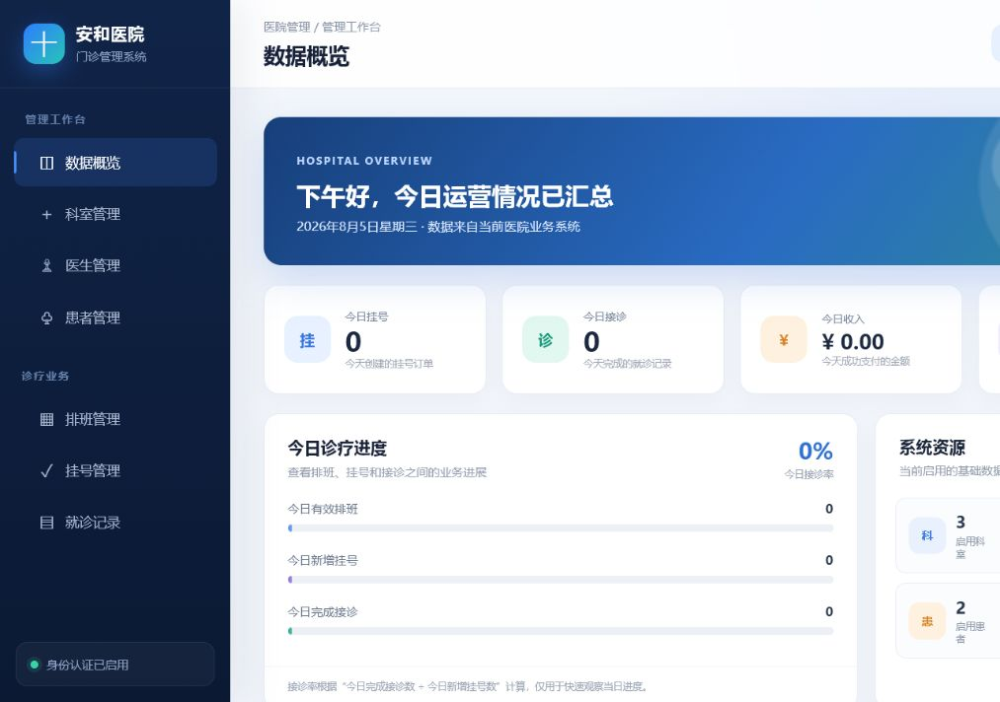
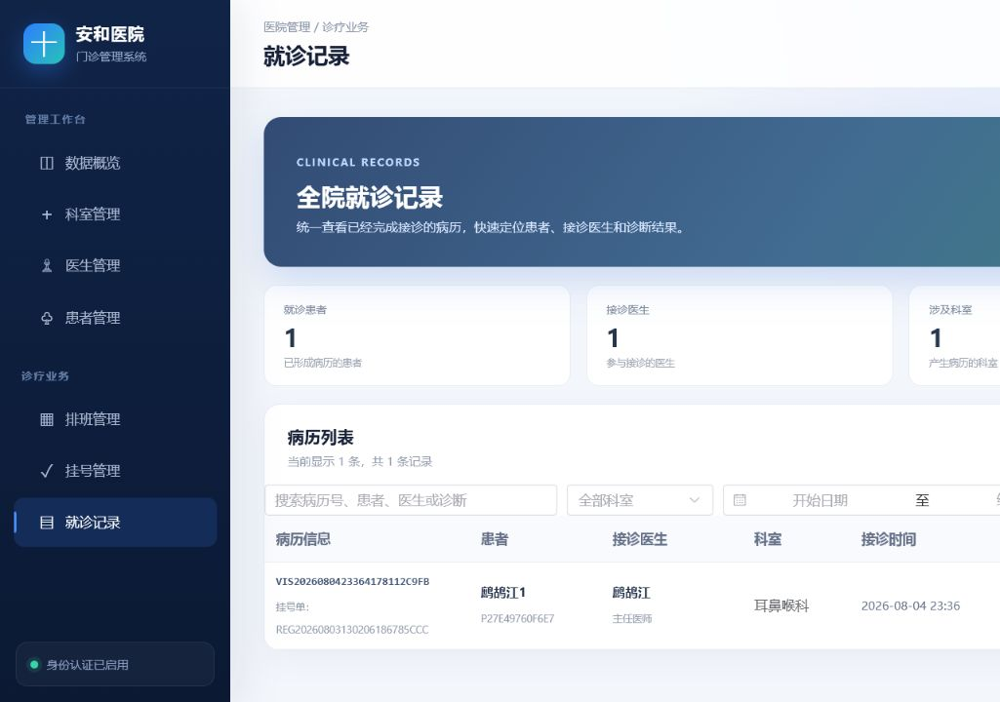
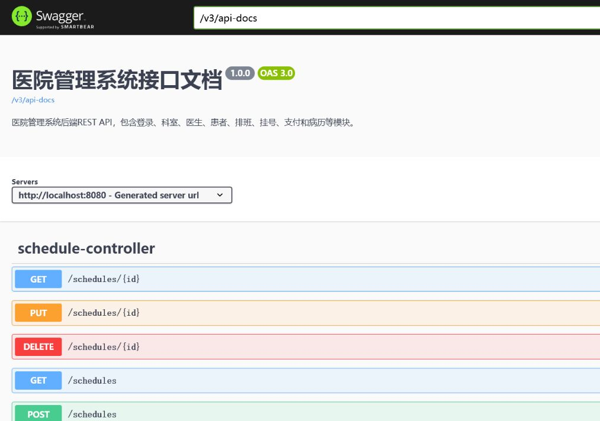

# 医院门诊管理系统

一个前后端分离的医院门诊业务练习项目。系统围绕“排班放号 → 患者挂号 → 模拟支付 → 医生接诊 → 形成病历”这一条完整业务链开发，并区分管理员和医生两类角色。

## 项目展示

### 管理员数据概览



### 全院就诊记录



### Swagger 接口文档



## 已实现功能

### 管理员端

- 科室、医生、患者的基础资料管理
- 医生排班与号源管理
- 挂号订单和支付状态管理
- 全院就诊记录查询
- 医院业务数据概览

### 医生端

- 查看个人排班
- 查看属于自己的待接诊挂号
- 完成接诊并填写病历
- 查看自己的历史就诊记录

### 通用能力

- Spring Security + JWT 登录认证
- 基于角色的接口和页面权限控制
- BCrypt 密码加密存储
- 统一返回结果、参数校验和业务异常处理
- OpenAPI / Swagger 在线接口文档

## 业务实现亮点

- **防止号源超卖**：通过数据库条件更新，在同一条 SQL 中判断余号并扣减，不采用“先查询再扣减”的不安全方式。
- **订单状态流转**：挂号订单按待支付、已支付、已取消、已超时等状态进行控制，避免非法操作。
- **支付幂等**：通过请求标识和数据库唯一约束，避免重复请求产生多次支付结果。
- **超时关闭**：定时任务扫描超过支付时间的订单，释放对应号源。
- **事务一致性**：挂号、支付、取消、接诊等涉及多张表的操作使用事务保证整体成功或整体回滚。
- **数据权限隔离**：医生只能查看并处理属于自己的排班、挂号和病历。

## 技术栈

| 部分 | 技术 |
| --- | --- |
| 后端 | Java 17、Spring Boot 3.2.10、Spring Security、JWT |
| 数据访问 | MyBatis-Plus 3.5.17、MySQL |
| 接口文档 | Springdoc OpenAPI 2.5.0、Swagger UI |
| 前端 | Vue 3、Vite、Element Plus、Axios |

## 项目结构

```text
医院管理系统/
├─ hospital-server/        # Spring Boot 后端
│  └─ src/main/java/com/example/
│     ├─ controller/       # 接收前端请求
│     ├─ service/impl/     # 业务规则及其实现
│     ├─ mapper/           # 数据库访问
│     ├─ entity/           # 数据库表对应对象
│     ├─ dto/              # 接收前端参数
│     ├─ vo/               # 返回给前端的数据
│     ├─ security/         # 登录认证与权限控制
│     └─ scheduler/        # 超时订单定时处理
├─ hospital-web/           # Vue 前端
└─ docs/screenshots/       # 项目展示图
```

## 本地运行

### 环境要求

- JDK 17
- MySQL 8.x
- Node.js `^22.18.0` 或 `>=24.12.0`
- Maven 3.x（也可使用项目自带的 Maven Wrapper）

### 1. 准备数据库

在 MySQL 中创建 `hospital_db`，并准备项目所需的表结构。当前项目仍使用已有的本地数据库；数据库初始化脚本和 Flyway 版本管理会在后续补充。

### 2. 配置并启动后端

复制：

```text
hospital-server/src/main/resources/application.example.yml
```

为：

```text
hospital-server/src/main/resources/application.yml
```

然后填写本机 MySQL 密码和 JWT 密钥，在 `hospital-server` 目录启动：

```bash
./mvnw spring-boot:run
```

Windows 可运行：

```powershell
.\mvnw.cmd spring-boot:run
```

### 3. 启动前端

在 `hospital-web` 目录运行：

```bash
npm install
npm run dev
```

前端默认地址：`http://localhost:5173`

接口文档地址：`http://localhost:8080/swagger-ui/index.html`

## 后续计划

- 使用 Flyway 管理数据库建表和升级脚本
- 为更多列表接口补充分页、筛选和排序
- 增加单元测试、接口测试和统一日志
- 在合适的业务场景中引入 Redis 与消息队列
- 业务规模扩大后，再评估是否拆分微服务

## 项目说明

这是一个学习型项目，重点不是堆叠技术名词，而是练习如何把数据库操作、业务规则、权限、事务和前端页面串成一套完整流程。仓库中的本机配置文件已被 Git 忽略，提交或部署前请勿上传真实数据库密码和 JWT 密钥。

本项目用于学习 Spring Boot 前后端分离项目的完整开发流程。